由于hmall中的搜索用mysql使用的是模糊搜索，效率较低

1. elasticsearch主要是解决模糊搜索的问题，可以大大的提高搜索的性能

1. 相对于mysql，elasticsearch能解决海量搜索的业务。比如在github中的海量的代码中搜索到某个字段


还有这种分割字段的搜索，elasticsearch也可以解决

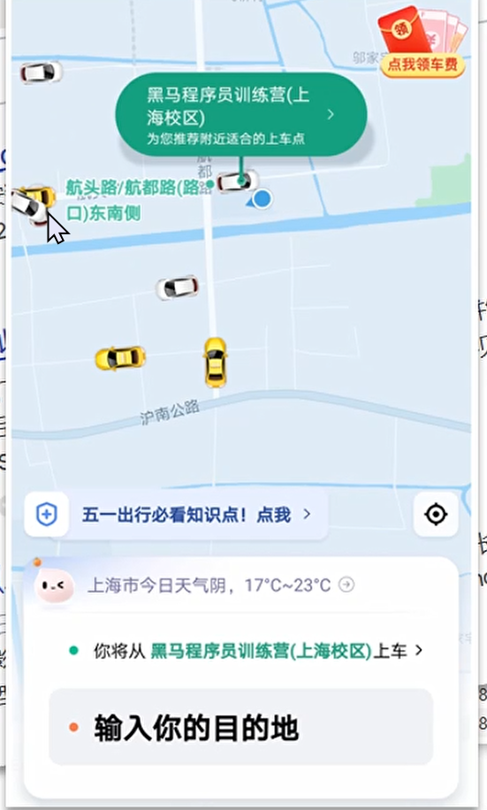

地理坐标搜索，数据库也无法实现。这些都要靠专业的搜索引擎来实现。

elasticsearch搜索引擎


elasticsearch是基于lucene来实现的


早期solar还是用的比较多的


elasticsearch 8.9的api有非常大的不同，跟以前完全不同。

选择的版本是7.12.1

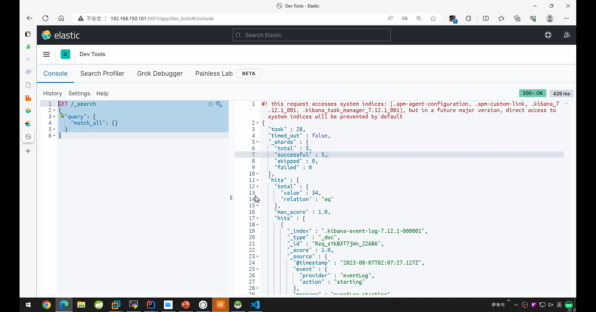

要求elastic都需要会写

倒排索引


正向索引是根据id查的时候（id有索引），效率非常高。而进行模糊搜索的时候，需要逐条的查，因此效率非常的低。


往倒排索引中插入数据的时候，要做两件事，一是在正向索引中创建文档，然后根据分词在倒排索引中添加词条。

由于倒排词条中的文档是使用的类似hash的搜索模式，所有相对于数据库完全正向索引的模糊搜索，效率非常的高

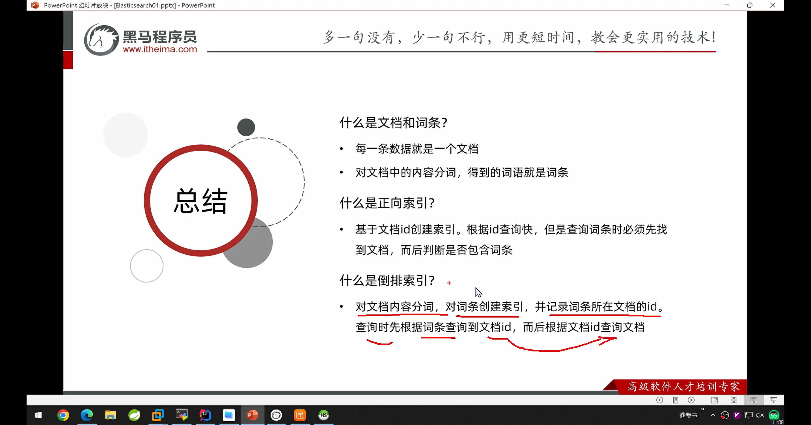

ik分词器

ik分词器的仓库

> 


注意：ik分词器的版本必须和elasticsearch的版本一致，而且是完全一致。否则不可运行

测试分词器

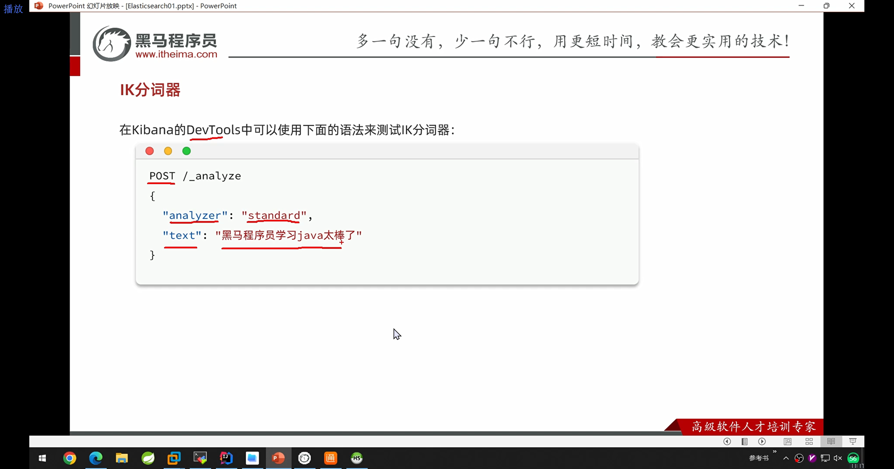

测试ik分词器


基础概念

elasticsearch的文档数据会以json的格式放存储

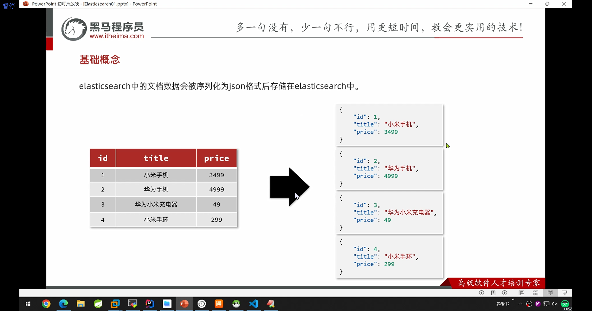

相同类型指的是：同样的字段结构


elasticsearch和mysql的对比


mapping映射（类似mysql的scheme）


是否建立索引index，主要考虑该字段是否是搜索、排序字段

properties作为子字段，主要是配合object使用

索引库操作


```json
PUT /hmall
{
  "mappings": {
    "properties": {
      "info": {
        "type": "text",
        "analyzer": "ik_smart",
        "index": true
      },
      "email":{
        "type": "keyword",
        "index": false
      },
      "name":{
        "type": "object",
        "properties": {
          "firstName": {
            "type": "keyword"
          },
          "lasttName": {
            "type": "keyword"
          }
        }
      }
    }
  }
}
```

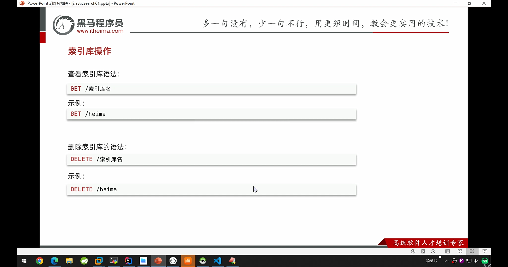

注意：索引库不能改

但是可以在原有的基础上添加新的字段

索引操作总结


文档操作

```json
#新增文档
POST /heima/_doc/1
{
    "info": "黑马程序员Java讲师",
    "email": "zy@itcast.cn",
    "name": {
        "firstName": "云",
        "lastName": "赵"
    }
}

#返回的结果
{
  "_index" : "heima",
  "_type" : "_doc",
  #把id转化为字符串
  "_id" : "1",
  #可以理解为做乐观锁的
  "_version" : 1,
  #执行结果
  "result" : "created",
  #分片，如果建设集群的话，就会把数据分层n份，增加存储的能力
  "_shards" : {
    "total" : 2,
    #存到其中一个片上
    "successful" : 1,
    "failed" : 0
  },
  "_seq_no" : 0,
  "_primary_term" : 1
}

```

查询文档数据

```json
#查询文档
GET /heima/_doc/1


#查询结果
{
  #索引库名
  "_index" : "heima",
  #查到的是文档
  "_type" : "_doc",
  #查询到的id
  "_id" : "1",
  #版本号是1
  "_version" : 1,
  #序列号
  "_seq_no" : 0,
  "_primary_term" : 1,
  #found = true表示找到了
  "found" : true,
  #sourc就是数据源
  "_source" : {
    "info" : "黑马程序员Java讲师",
    "email" : "zy@itcast.cn",
    "name" : {
      "firstName" : "云",
      "lastName" : "赵"
    }
  }
}

```

删除文档

```json
DELETE /heima/_doc/1

#结果是
{
  "_index" : "heima",
  "_type" : "_doc",
  "_id" : "1",
  "_version" : 2,
  "result" : "deleted",
  "_shards" : {
    "total" : 2,
    "successful" : 1,
    "failed" : 0
  },
  "_seq_no" : 1,
  "_primary_term" : 1
}

```

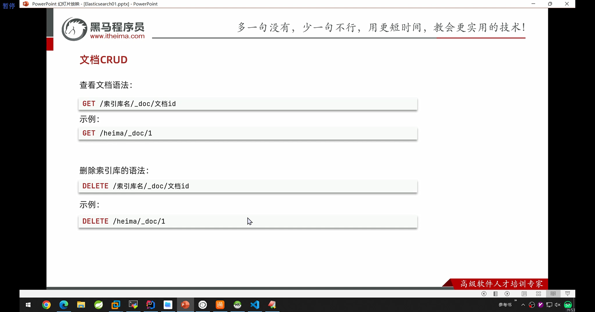

修改文档

```json
#修改文档（先删，再增）。增量修改
PUT /heima/_doc/1
{
    "info": "黑马程序员Java讲师2号",
    "email": "zy@itcast.cn",
    "name": {
        "firstName": "云",
        "lastName": "赵"
    }
}


#存量修改
POST  /heima/_update/1
{
  "doc": {
    "name":{
      "firstName":"云"
    }
  }
}
```


文档crud总结

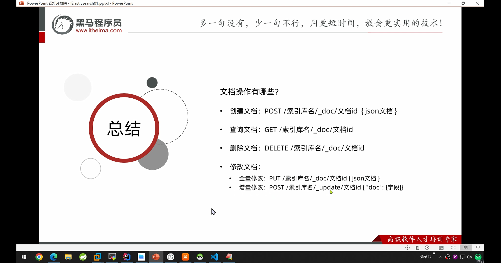

批量处理

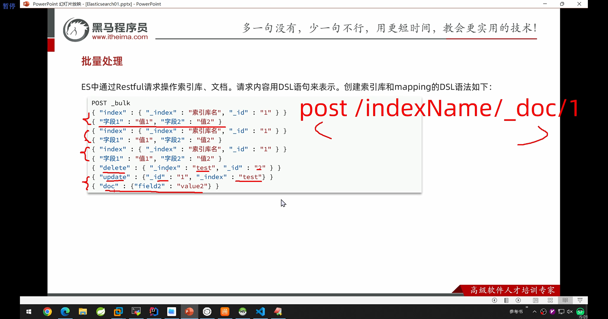

 批量CURD

```json

POST /_bulk
{"index":{"_index":"hmall","_id":"3"}}
{"info":"黑马程序员Python讲师","email":"zs@itcast.cn","name":{"firstName":"四","lastName":"赵"}}
{"index":{"_index":"hmall","_id":"4"}}
{"info":"黑马程序员Python讲师","email":"ww@itcast.cn","name":{"firstName":"王","lastName":"五"}}

GET /hmall/_doc/3

#批量删除
POST /_bulk
{"delete":{"_index":"hmall", "_id":"3"}}
{"delete":{"_index":"hmall", "_id":"4"}}

```

javarestClient

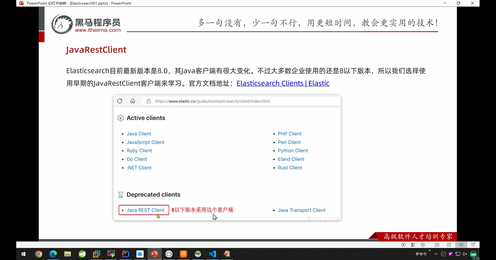

elasticsearch和本地项目关联的流程


客户端初始化

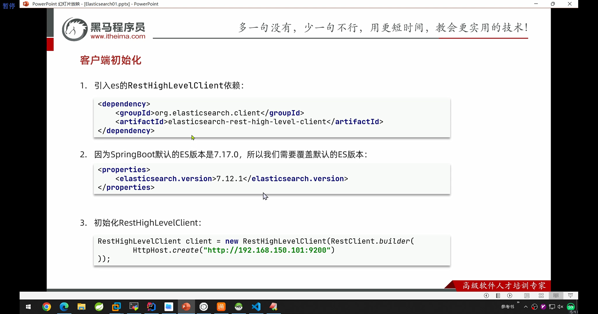

```xml
引入客户端依赖
<dependency>
   <groupId>org.elasticsearch.client</groupId>
    <artifactId>elasticsearch-rest-high-level-client</artifactId>
</dependency>

因为 Spring Boot 默认的 ES 版本是 7.17.0，所以我们需要覆盖默认的 ES 版本
<properties>
    <elasticsearch.version>7.12.1</elasticsearch.version>
</properties>

初始化
RestHighLevelClient client = new RestHighLevelClient(RestClient.builder(
    HttpHost.create("http://192.168.150.101:9200")
));

```

商品表mapping映射


分析search的需求

字段要求

搜索：

1. 分类

1. 品牌

1. 价格

1. 销量

1. 名称

展示：

1. 图片

1. 评价数量

1. 是否是广告商品

对比数据库的scheme

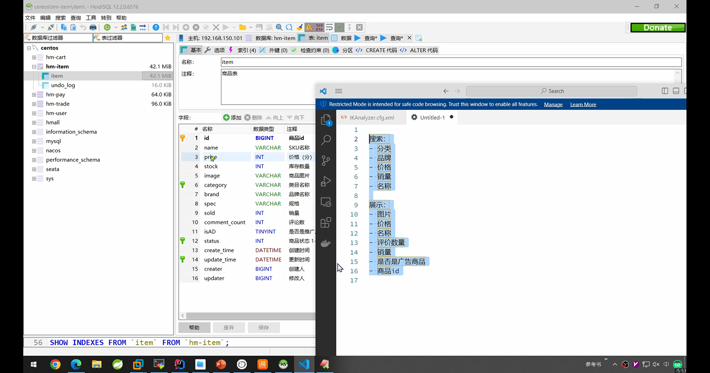

根据业务创建商品索引库

```json
#商品索引库
PUT /item
{
  "mappings": {
    "properties": {
      "id":{
        "type": "long",
        "index": true
      },
      "name":{
        "type": "text",
        "analyzer": "ik_smart",
        "index": true
      },
        "category":{
        "type": "keyword",
        "index": true
      },
      "brand":{
        "type": "keyword",
        "index": true
      },
       "price":{
        "type": "integer",
        "index": true
      },
        "sold":{
        "type": "integer",
        "index": true
      },
        "image":{
        "type": "keyword",
        "index": false
      },
      "commentCount":{
        "type": "integer",
        "index": false
      },
       "isAD":{
        "type": "boolean",
        "index": true
      }
    }
  }
}
```

索引库操作


java使用restful java client操作mapping

```java
package com.hmall.item.es;
import org.apache.http.HttpHost;
import org.elasticsearch.action.admin.indices.delete.DeleteIndexRequest;
import org.elasticsearch.client.Request;
import org.elasticsearch.client.RequestOptions;
import org.elasticsearch.client.RestClient;
import org.elasticsearch.client.RestHighLevelClient;
import org.elasticsearch.client.indices.CreateIndexRequest;
import org.elasticsearch.client.indices.GetIndexRequest;
import org.elasticsearch.common.xcontent.XContentType;
import org.junit.jupiter.api.AfterEach;
import org.junit.jupiter.api.BeforeEach;
import org.junit.jupiter.api.Test;
public class ElasticTest {
private RestHighLevelClient client;


@Test
void testConnection(){
    System.out.println("restHighLevelClient = " + client);
}

@Test
void testCreateIndex() throws Exception{
    //1.准备request对象
    CreateIndexRequest request = new CreateIndexRequest("items");
    //2.准备请求参数
    request.source(MAPPING_TEMPLATE, XContentType.JSON);
    //3.发送请求
    client.indices().create(request, RequestOptions.DEFAULT);

}


@Test
void testDeleteIndex() throws Exception{
    //1.准备request对象
    DeleteIndexRequest request = new DeleteIndexRequest("items");
    //2.准备请求参数
  /*  request.source(MAPPING_TEMPLATE, XContentType.JSON);*/
    //3.发送请求
    client.indices().delete(request, RequestOptions.DEFAULT);

}

@Test
void testGetIndex() throws Exception{
    //1.准备request对象
    GetIndexRequest request = new GetIndexRequest("items");
    //2.准备请求参数
    /*  request.source(MAPPING_TEMPLATE, XContentType.JSON);*/
    //3.发送请求
    boolean exists = client.indices().exists(request, RequestOptions.DEFAULT);
    System.out.println("exists = " + exists);

}

@BeforeEach
//每个单元测试前，先初始化
void setUp() throws Exception {
    client = new RestHighLevelClient(RestClient.builder(
            HttpHost.create("http://localhost:9201")
    ));
}

@AfterEach
//执行完了之后进行关闭资源
void tearDown() throws Exception {
    client.close();
}

private static final String MAPPING_TEMPLATE = "{\n" +
        "  \"mappings\": {\n" +
        "    \"properties\": {\n" +
        "      \"id\":{\n" +
        "        \"type\": \"long\",\n" +
        "        \"index\": true\n" +
        "      },\n" +
        "      \"name\":{\n" +
        "        \"type\": \"text\",\n" +
        "        \"analyzer\": \"ik_smart\",\n" +
        "        \"index\": true\n" +
        "      },\n" +
        "      \"category\":{\n" +
        "        \"type\": \"keyword\",\n" +
        "        \"index\": true\n" +
        "      },\n" +
        "      \"brand\":{\n" +
        "        \"type\": \"keyword\",\n" +
        "        \"index\": true\n" +
        "      },\n" +
        "      \"price\":{\n" +
        "        \"type\": \"integer\",\n" +
        "        \"index\": true\n" +
        "      },\n" +
        "      \"sold\":{\n" +
        "        \"type\": \"integer\",\n" +
        "        \"index\": true\n" +
        "      },\n" +
        "      \"image\":{\n" +
        "        \"type\": \"keyword\",\n" +
        "        \"index\": false\n" +
        "      },\n" +
        "      \"commentCount\":{\n" +
        "        \"type\": \"integer\",\n" +
        "        \"index\": false\n" +
        "      },\n" +
        "      \"isAD\":{\n" +
        "        \"type\": \"boolean\",\n" +
        "        \"index\": true\n" +
        "      }\n" +
        "    }\n" +
        "  }\n" +
        "}";

}
```

索引库操作步骤

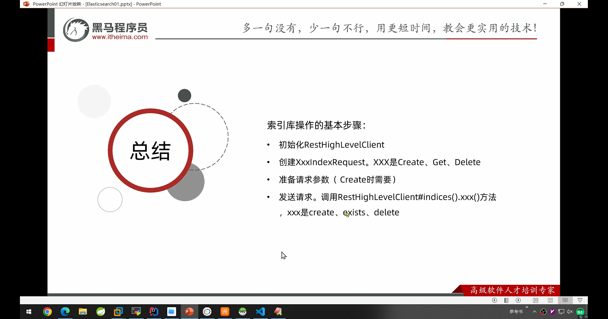

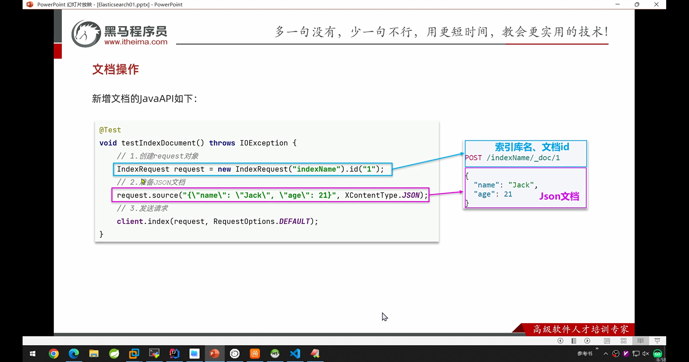

 

```java
package com.hmall.item.es;
import cn.hutool.core.bean.BeanUtil;
import cn.hutool.json.JSON;
import cn.hutool.json.JSONUtil;
import com.baomidou.mybatisplus.extension.plugins.pagination.Page;
import com.hmall.item.domain.dto.ItemDocDTO;
import com.hmall.item.domain.po.Item;
import com.hmall.item.service.IItemService;
import lombok.RequiredArgsConstructor;
import org.apache.http.HttpHost;
import org.elasticsearch.action.admin.indices.delete.DeleteIndexRequest;
import org.elasticsearch.action.bulk.BulkRequest;
import org.elasticsearch.action.delete.DeleteRequest;
import org.elasticsearch.action.delete.DeleteResponse;
import org.elasticsearch.action.get.GetRequest;
import org.elasticsearch.action.get.GetResponse;
import org.elasticsearch.action.index.IndexRequest;
import org.elasticsearch.action.index.IndexResponse;
import org.elasticsearch.action.update.UpdateRequest;
import org.elasticsearch.action.update.UpdateResponse;
import org.elasticsearch.client.RequestOptions;
import org.elasticsearch.client.RestClient;
import org.elasticsearch.client.RestHighLevelClient;
import org.elasticsearch.client.indices.CreateIndexRequest;
import org.elasticsearch.client.indices.GetIndexRequest;
import org.elasticsearch.common.xcontent.XContentType;
import org.junit.jupiter.api.AfterEach;
import org.junit.jupiter.api.BeforeEach;
import org.junit.jupiter.api.Test;
import org.springframework.beans.BeanUtils;
import org.springframework.beans.factory.annotation.Autowired;
import org.springframework.boot.test.context.SpringBootTest;
import org.springframework.context.annotation.Bean;
import java.util.List;
@SpringBootTest(properties = "spring.profiles.active=local")
public class ElasticDocumentTest {
private RestHighLevelClient client;

@Autowired
private IItemService itemService;

//全量修改
@Test
void testSaveDocument() throws Exception {
    //从数据库中查询商品数据
    Item item = itemService.getById(317578L);

    //1.准备request
    IndexRequest request = new IndexRequest("items").id(item.getId().toString());
    //2.准备请求参数
    request.source(JSONUtil.toJsonStr(BeanUtil.copyProperties(item, ItemDocDTO.class)), XContentType.JSON);
    //3.发送请求
    IndexResponse response = client.index(request, RequestOptions.DEFAULT);
    System.out.println("response: " + response);
}

@Test
void testupdateDocument() throws Exception {
    //从数据库中查询商品数据
    Item item = itemService.getById(317578L);

    //1.准备request
    UpdateRequest request = new UpdateRequest("items", item.getId().toString());
    //2.准备请求参数
    /*  request.source(JSONUtil.toJsonStr(BeanUtil.copyProperties(item, ItemDocDTO.class)), XContentType.JSON);*/
    request.doc(
            "price", 2000,
            "stock", 200
    );
    //3.发送请求
    UpdateResponse response = client.update(request, RequestOptions.DEFAULT);
    System.out.println("response: " + response);
}

@Test
void testGetDocumentById() throws Exception {
    //从数据库中查询商品数据
    Item item = itemService.getById(317578L);

    //1.准备request
    GetRequest request = new GetRequest("items").id("317578");
    //2.发送请求
    GetResponse response = client.get(request, RequestOptions.DEFAULT);
    //3.解析请求结果
    String json = response.getSourceAsString();
    ItemDocDTO result = JSONUtil.toBean(json, ItemDocDTO.class);
    System.out.println(result);
}

@Test
void testBulk() throws Exception {
    //从数据库中查询商品数据
    int pageNo = 1, pageSize = 1000;
    while (true){
        Page<Item> page = itemService.lambdaQuery().eq(Item::getStatus, 1).page(Page.of(pageNo, pageSize));
        List<Item> records = page.getRecords();
        if (records == null || records.size() == 0) {
            return;
        }
        //1.准备request
        BulkRequest request = new BulkRequest();
        //2.准备请求参数
        /*  request.source(JSONUtil.toJsonStr(BeanUtil.copyProperties(item, ItemDocDTO.class)), XContentType.JSON);*/
        for (Item item : records) {
            request.add(new IndexRequest("items")
                    .id(item.getId().toString())
                    .source(JSONUtil.toJsonStr(BeanUtil.copyProperties(item, ItemDocDTO.class)), XContentType.JSON));
        }
        //3.发送请求
        /*  UpdateResponse response = client.update(request, RequestOptions.DEFAULT);*/
        client.bulk(request, RequestOptions.DEFAULT);
        //4.翻页
        pageNo++;
    }
}

@Test
void testGetDocument() throws Exception {
    //从数据库中查询商品数据
    Item item = itemService.getById(317578L);

    //1.准备request
    GetRequest request = new GetRequest("items").id("317578");
    //2.准备请求参数
    /* request.source(JSONUtil.toJsonStr(item),XContentType.JSON);*/
    //3.发送请求
    GetResponse response = client.get(request, RequestOptions.DEFAULT);
    System.out.println("response: " + response);
}

@Test
void testDeleteDocument() throws Exception {
    //从数据库中查询商品数据
    Item item = itemService.getById(317578L);

    //1.准备request
    DeleteRequest request = new DeleteRequest("items").id(item.getId().toString());

    //2.准备请求参数
    /* request.source(JSONUtil.toJsonStr(item),XContentType.JSON);*/

    //3.发送请求
    DeleteResponse delete = client.delete(request, RequestOptions.DEFAULT);
    System.out.println(delete.toString());
}


@BeforeEach
    //每个单元测试前，先初始化
void setUp() throws Exception {
    client = new RestHighLevelClient(RestClient.builder(
            HttpHost.create("http://localhost:9201")
    ));
}

@AfterEach
    //执行完了之后进行关闭资源
void tearDown() throws Exception {
    client.close();
}

}

需要定义一个跟索引一样的dto

package com.hmall.item.domain.dto;
import com.baomidou.mybatisplus.annotation.IdType;
import com.baomidou.mybatisplus.annotation.TableField;
import com.baomidou.mybatisplus.annotation.TableId;
import com.baomidou.mybatisplus.annotation.TableName;
import lombok.Data;
import lombok.EqualsAndHashCode;
import lombok.experimental.Accessors;
import java.io.Serializable;
import java.time.LocalDateTime;
/**
<p>
商品表
</p>

@author 虎哥
@since 2023-05-05*/@Data@EqualsAndHashCode(callSuper = false)@Accessors(chain = true)public class ItemDocDTO{
/**
商品id*/private Long id;
/**
SKU名称*/private String name;
/**
价格（分）*/private Integer price;
/**
库存数量*/private Integer stock;
/**
商品图片*/private String image;
/**
类目名称*/private String category;
/**
品牌名称*/private String brand;
/**
销量*/private Integer sold;
/**
评论数*/private Integer commentCount;
/**
是否是推广广告，true/false*/@TableField("isAD")private Boolean isAD;
}
```

否则就会乱入

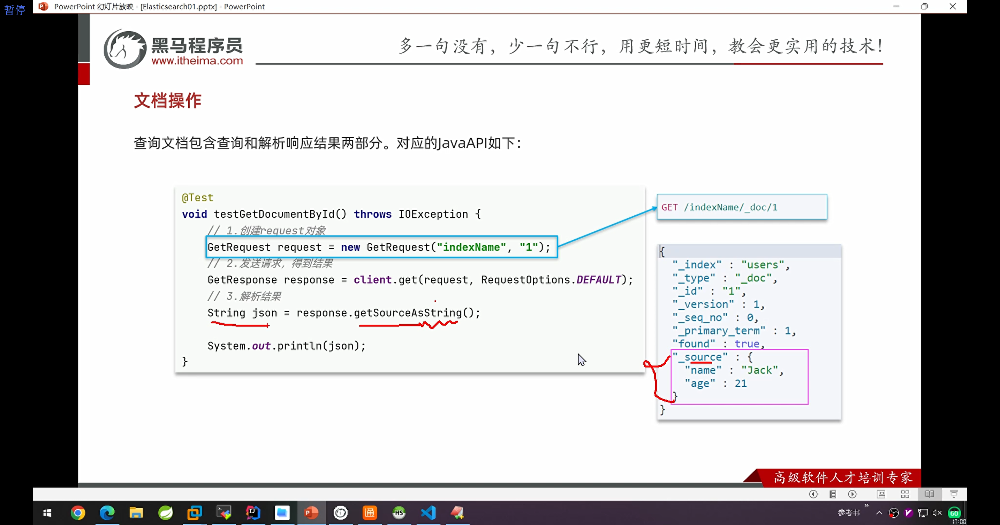

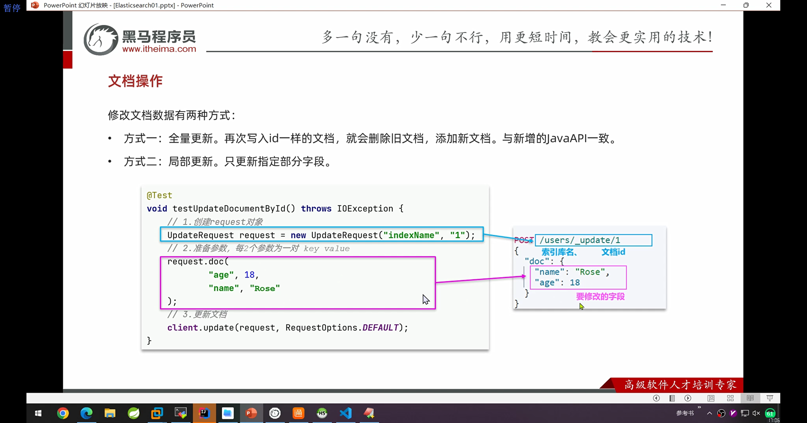

文档操作curd

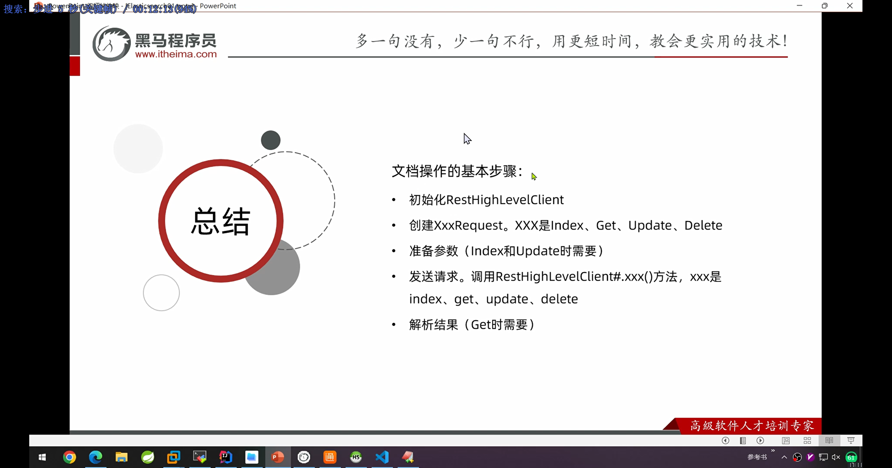

```java

```

批处理

