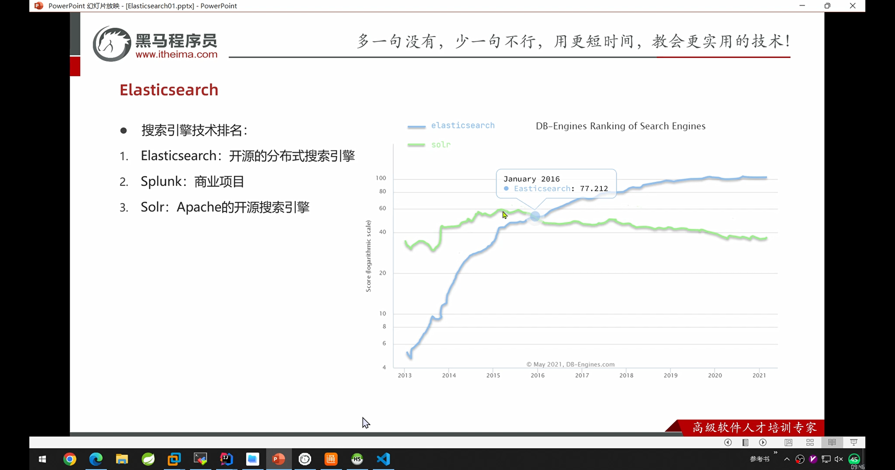
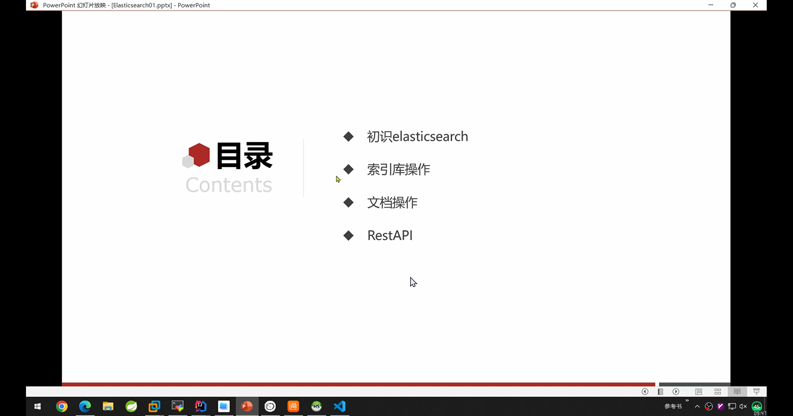
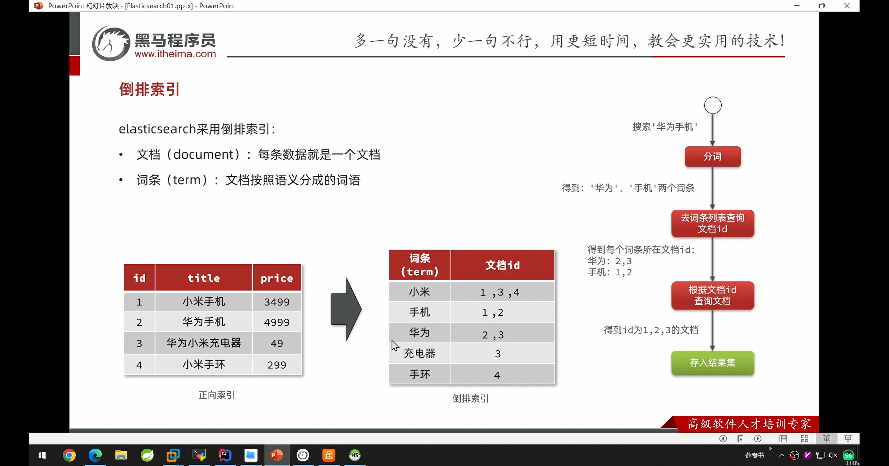

由于hmall中的搜索用mysql使用的是模糊搜索，效率较低

1. elasticsearch主要是解决模糊搜索的问题，可以大大的提高搜索的性能

1. 相对于mysql，elasticsearch能解决海量搜索的业务。比如在github中的海量的代码中搜索到某个字段

还有这种分割字段的搜索，elasticsearch也可以解决

地理坐标搜索，数据库也无法实现。这些都要靠专业的搜索引擎来实现。

elasticsearch搜索引擎

elasticsearch是基于lucene来实现的

早期solar还是用的比较多的

elasticsearch 8.9的api有非常大的不同，跟以前完全不同。

选择的版本是7.12.1

要求elastic都需要会写

倒排索引

正向索引是根据id查的时候（id有索引），效率非常高。而进行模糊搜索的时候，需要逐条的查，因此效率非常的低。

往倒排索引中插入数据的时候，要做两件事，一是在正向索引中创建文档，然后根据分词在倒排索引中添加词条。

由于倒排词条中的文档是使用的类似hash的搜索模式，所有相对于数据库完全正向索引的模糊搜索，效率非常的高

ik分词器