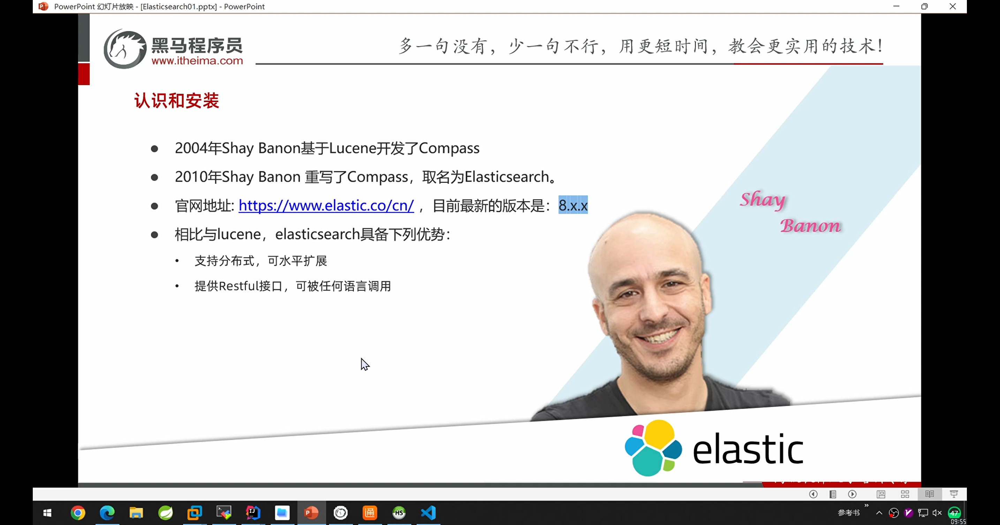
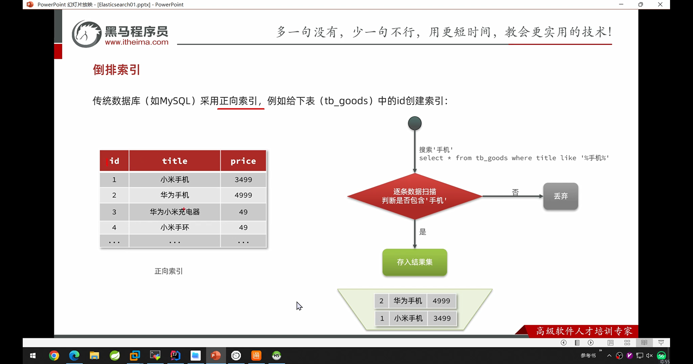
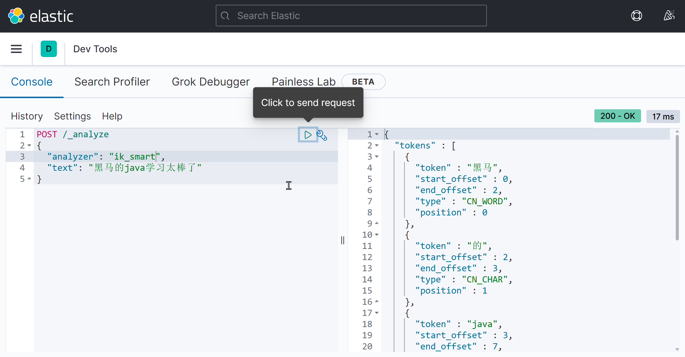
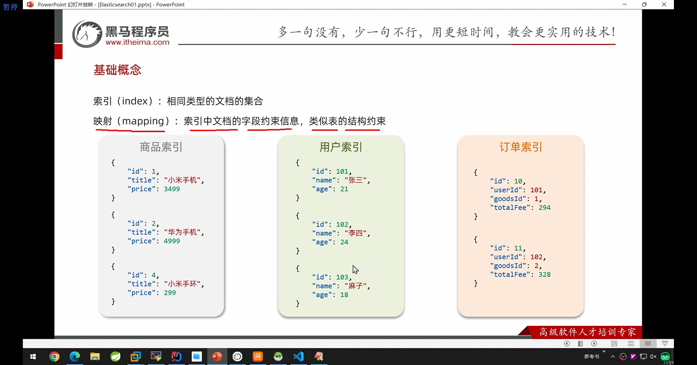
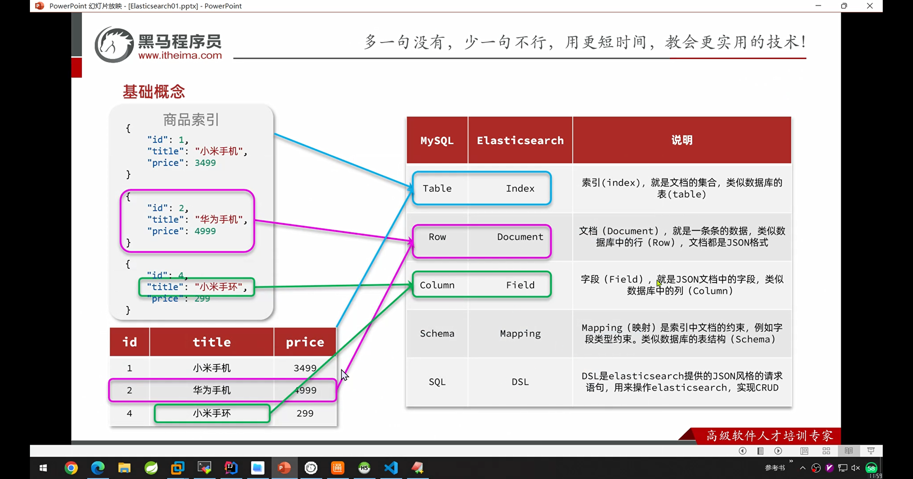
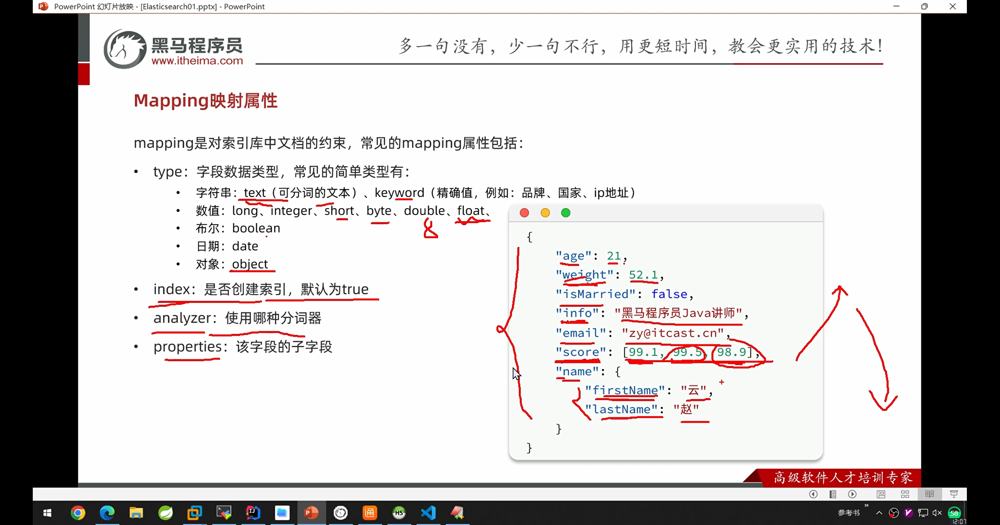
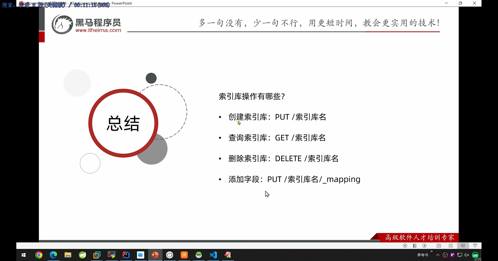
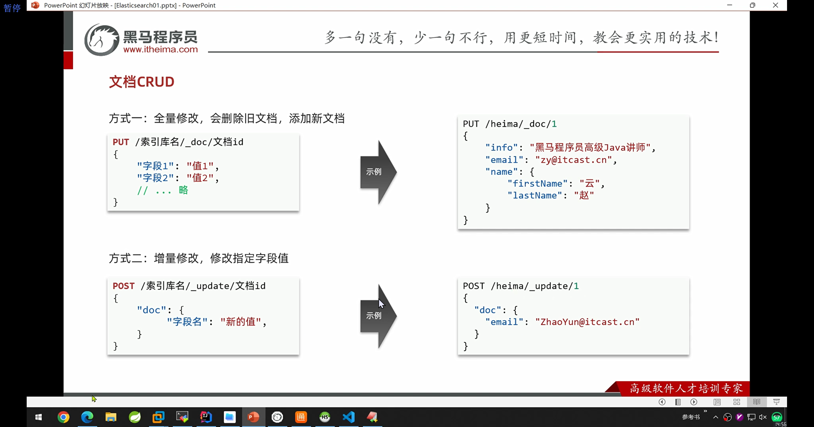
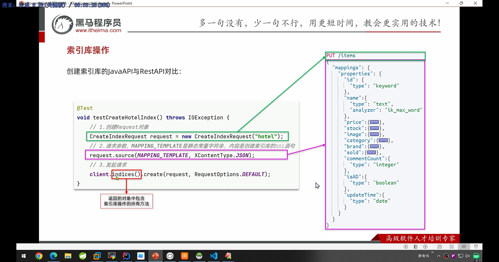

由于hmall中的搜索用mysql使用的是模糊搜索，效率较低

1. elasticsearch主要是解决模糊搜索的问题，可以大大的提高搜索的性能

1. 相对于mysql，elasticsearch能解决海量搜索的业务。比如在github中的海量的代码中搜索到某个字段


还有这种分割字段的搜索，elasticsearch也可以解决


地理坐标搜索，数据库也无法实现。这些都要靠专业的搜索引擎来实现。

elasticsearch搜索引擎


elasticsearch是基于lucene来实现的


早期solar还是用的比较多的



elasticsearch 8.9的api有非常大的不同，跟以前完全不同。

选择的版本是7.12.1


要求elastic都需要会写

倒排索引



正向索引是根据id查的时候（id有索引），效率非常高。而进行模糊搜索的时候，需要逐条的查，因此效率非常的低。


往倒排索引中插入数据的时候，要做两件事，一是在正向索引中创建文档，然后根据分词在倒排索引中添加词条。

由于倒排词条中的文档是使用的类似hash的搜索模式，所有相对于数据库完全正向索引的模糊搜索，效率非常的高


ik分词器

ik分词器的仓库

> 


注意：ik分词器的版本必须和elasticsearch的版本一致，而且是完全一致。否则不可运行

测试分词器


测试ik分词器



基础概念

elasticsearch的文档数据会以json的格式放存储


相同类型指的是：同样的字段结构



elasticsearch和mysql的对比



mapping映射（类似mysql的scheme）



是否建立索引index，主要考虑该字段是否是搜索、排序字段

properties作为子字段，主要是配合object使用

索引库操作


```json
PUT /hmall
{
  "mappings": {
    "properties": {
      "info": {
        "type": "text",
        "analyzer": "ik_smart",
        "index": true
      },
      "email":{
        "type": "keyword",
        "index": false
      },
      "name":{
        "type": "object",
        "properties": {
          "firstName": {
            "type": "keyword"
          },
          "lasttName": {
            "type": "keyword"
          }
        }
      }
    }
  }
}
```


注意：索引库不能改

但是可以在原有的基础上添加新的字段

索引操作总结



文档操作

```json
#新增文档
POST /heima/_doc/1
{
    "info": "黑马程序员Java讲师",
    "email": "zy@itcast.cn",
    "name": {
        "firstName": "云",
        "lastName": "赵"
    }
}

#返回的结果
{
  "_index" : "heima",
  "_type" : "_doc",
  #把id转化为字符串
  "_id" : "1",
  #可以理解为做乐观锁的
  "_version" : 1,
  #执行结果
  "result" : "created",
  #分片，如果建设集群的话，就会把数据分层n份，增加存储的能力
  "_shards" : {
    "total" : 2,
    #存到其中一个片上
    "successful" : 1,
    "failed" : 0
  },
  "_seq_no" : 0,
  "_primary_term" : 1
}

```

查询文档数据

```json
#查询文档
GET /heima/_doc/1


#查询结果
{
  #索引库名
  "_index" : "heima",
  #查到的是文档
  "_type" : "_doc",
  #查询到的id
  "_id" : "1",
  #版本号是1
  "_version" : 1,
  #序列号
  "_seq_no" : 0,
  "_primary_term" : 1,
  #found = true表示找到了
  "found" : true,
  #sourc就是数据源
  "_source" : {
    "info" : "黑马程序员Java讲师",
    "email" : "zy@itcast.cn",
    "name" : {
      "firstName" : "云",
      "lastName" : "赵"
    }
  }
}

```

删除文档

```json
DELETE /heima/_doc/1

#结果是
{
  "_index" : "heima",
  "_type" : "_doc",
  "_id" : "1",
  "_version" : 2,
  "result" : "deleted",
  "_shards" : {
    "total" : 2,
    "successful" : 1,
    "failed" : 0
  },
  "_seq_no" : 1,
  "_primary_term" : 1
}

```


修改文档

```json
#修改文档（先删，再增）。增量修改
PUT /heima/_doc/1
{
    "info": "黑马程序员Java讲师2号",
    "email": "zy@itcast.cn",
    "name": {
        "firstName": "云",
        "lastName": "赵"
    }
}


#存量修改
POST  /heima/_update/1
{
  "doc": {
    "name":{
      "firstName":"云"
    }
  }
}
```



文档crud总结


批量处理


 批量CURD

```json

POST /_bulk
{"index":{"_index":"hmall","_id":"3"}}
{"info":"黑马程序员Python讲师","email":"zs@itcast.cn","name":{"firstName":"四","lastName":"赵"}}
{"index":{"_index":"hmall","_id":"4"}}
{"info":"黑马程序员Python讲师","email":"ww@itcast.cn","name":{"firstName":"王","lastName":"五"}}

GET /hmall/_doc/3

#批量删除
POST /_bulk
{"delete":{"_index":"hmall", "_id":"3"}}
{"delete":{"_index":"hmall", "_id":"4"}}

```

javarestClient


elasticsearch和本地项目关联的流程


客户端初始化


```xml
引入客户端依赖
<dependency>
   <groupId>org.elasticsearch.client</groupId>
    <artifactId>elasticsearch-rest-high-level-client</artifactId>
</dependency>

因为 Spring Boot 默认的 ES 版本是 7.17.0，所以我们需要覆盖默认的 ES 版本
<properties>
    <elasticsearch.version>7.12.1</elasticsearch.version>
</properties>

初始化
RestHighLevelClient client = new RestHighLevelClient(RestClient.builder(
    HttpHost.create("http://192.168.150.101:9200")
));

```

商品表mapping映射


分析search的需求

字段要求

搜索：

1. 分类

1. 品牌

1. 价格

1. 销量

1. 名称

展示：

1. 图片

1. 评价数量

1. 是否是广告商品

对比数据库的scheme


根据业务创建商品索引库

```json
#商品索引库
PUT /item
{
  "mappings": {
    "properties": {
      "id":{
        "type": "long",
        "index": true
      },
      "name":{
        "type": "text",
        "analyzer": "ik_smart",
        "index": true
      },
        "category":{
        "type": "keyword",
        "index": true
      },
      "brand":{
        "type": "keyword",
        "index": true
      },
       "price":{
        "type": "integer",
        "index": true
      },
        "sold":{
        "type": "integer",
        "index": true
      },
        "image":{
        "type": "keyword",
        "index": false
      },
      "commentCount":{
        "type": "integer",
        "index": false
      },
       "isAD":{
        "type": "boolean",
        "index": true
      }
    }
  }
}
```

索引库操作



