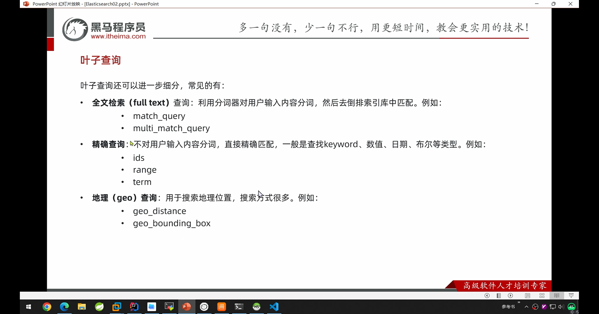
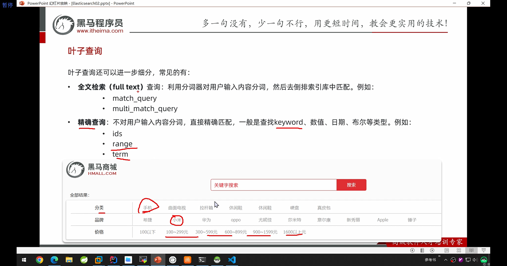
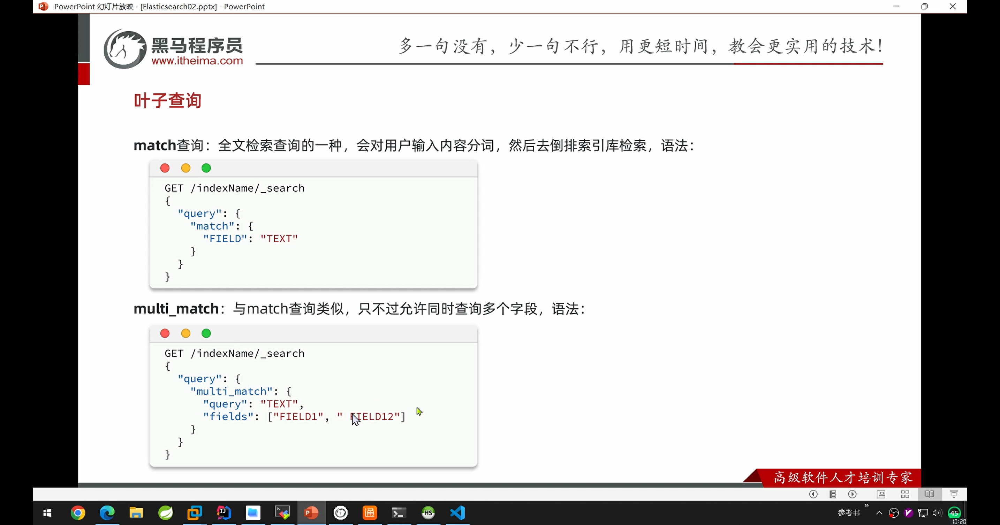
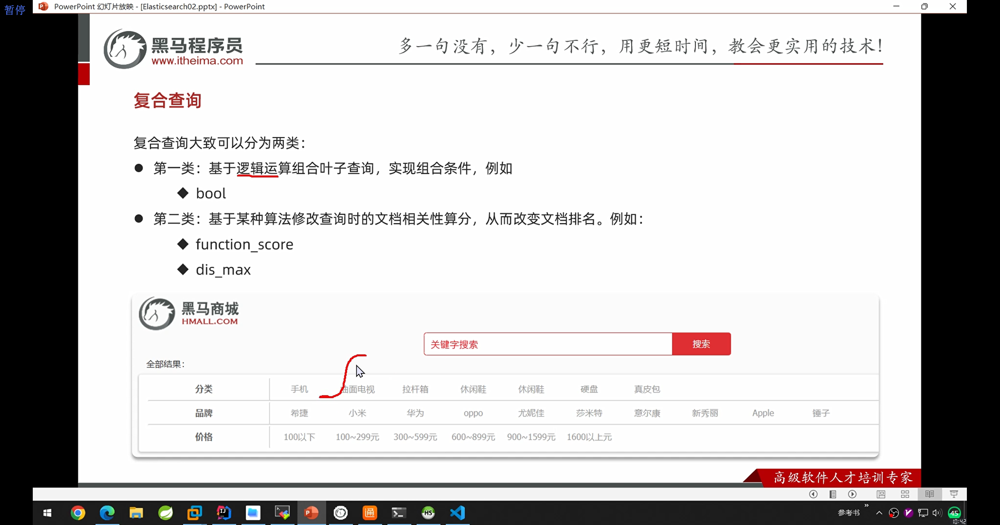
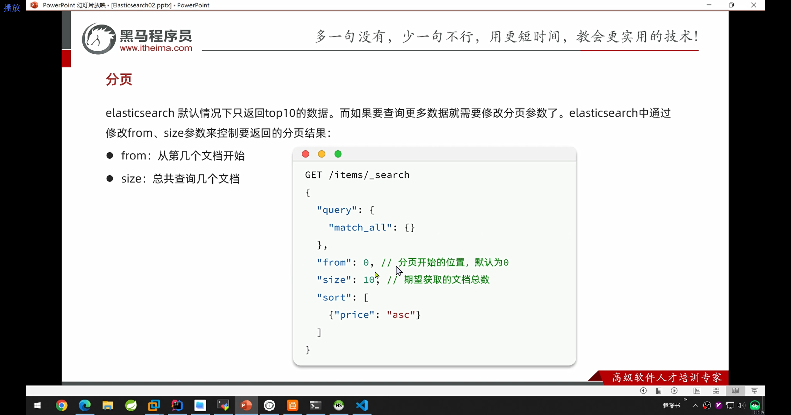
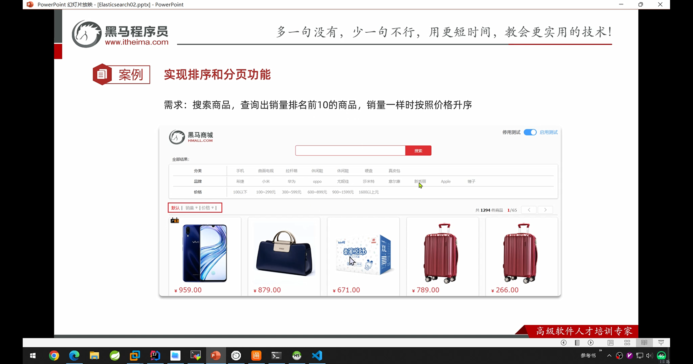
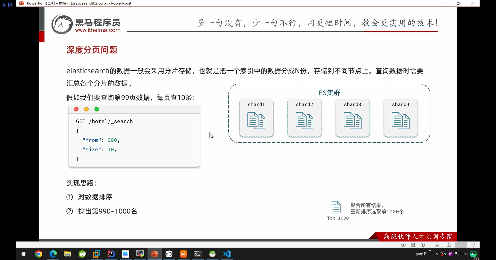
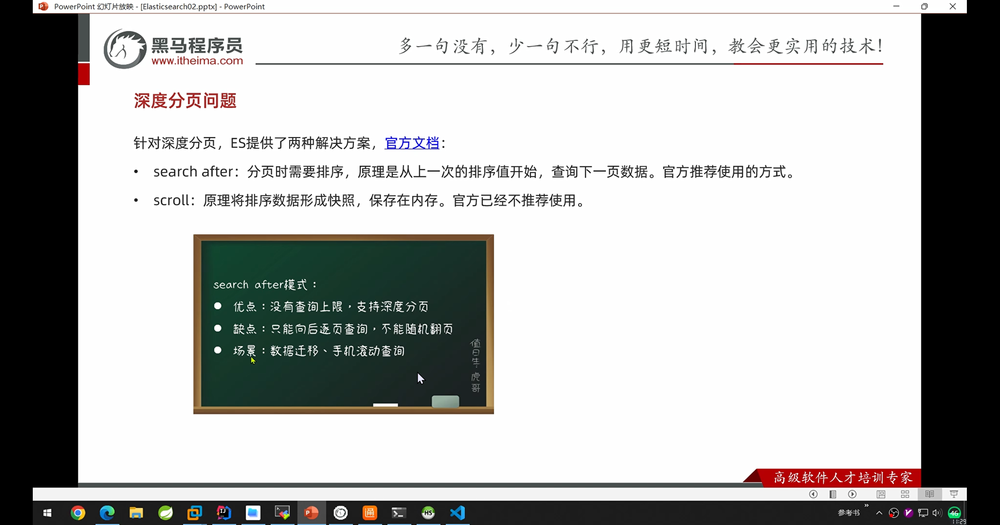
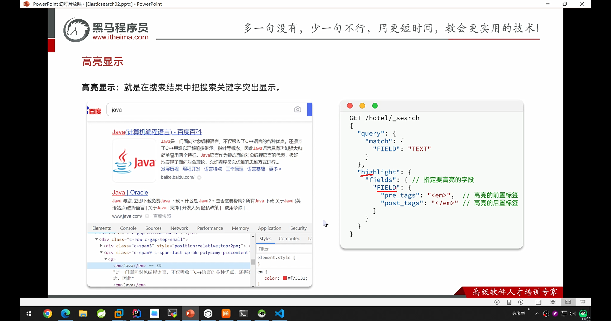

elasticsearch基于json的dsl是必学的，因为即便是java实现也是对json进行了组合。而dsl可以直接验证方案的可行性


indexName是elasticsearch中库的name



对应的业务分析



叶子查询



```json
GET /items/_count

GET /items/_search
{
  "query": {
    "match_all": {
     
    }
  }
}

GET /items/_search
{
  "query": {
    "match": {
      "name":"脱脂牛奶"
    }
  }
}
```


注意term的value是不会分词的，是精确匹配

```json

GET /items/_search
{
  "query": {
    "term": {
      "category": {
        "value": "牛奶"
      }
    }
  }
}

GET /items/_search
{
  "query": {
    "term": {
      "brand": {
        "value": "飞利浦"
      }
    }
  }
}

GET /items/_search
{
  "query": {
    "range": {
      "price": {
        "gte": 5000
      }
    }
  }
}
```

叶子查询总结


复合查询



布尔查询


其中算分时关联度的意思。如果使用filter的搜索就不参与算法。不参与算分是不影响排名前后的，对于name来讲需要算分，但是对于range来讲不需要算分，因为算分会增加处理的时间。

复合查询

需求：搜索"智能手机"，但品牌必须是华为，价格必须是900~1599

```json
GET /items/_search
{
  "query": {
    "bool": {
      "must": [
        {
          "match": {
            "name": "智能手机"
          }
        }
      ],
      "filter": [
        {
          "term": {
            "brand": "华为"
          }
        },
        {
          "range": {
            "price": {
              "gte": 900,
              "lte": 1599
            }
          }
        }
      ]
    }
  }
}
```

一般情况下，我们认为过滤条件如分类、品牌、价格不应该参与算法。而关键字是必须要进行打分的


排序和分页

由于name可分词并且建立的是倒排索引，所以无法排序。而其它类型的字段如keyword字段都是可以做排序的


实现排序功能：


实现如下

```json
GET /items/_search
{
  "query": {
    "match_all": {
      
    }
  },
  "sort": [
    {
      "sold": {
        "order": "desc"
      },
      "price": {
        "order": "asc"
      }
    }
  ]
}

POST /items/_update/100000004580
{
  "doc": {
    "sold": 45454
  }
}

```

分页



```json
#from = (page - 1) * size
GET /items/_search
{
  "query": {
    "match_all": {
      
    }
  },
  "sort": [
    {
      "sold": {
        "order": "desc"
      },
      "price": {
        "order": "asc"
      }
    }
  ],
  "from": 2,
  "size": 2
}
```

分页实现案例



```json
GET /items/_search
{
  "query": {
    "match_all": {
      
    }
  },
  "sort": [
    {
      "sold": {
        "order": "desc"
      },
      "price": {
        "order": "asc"
      }
    }
  ],
  "size": 10
}
```

深度分页问题



深度分页思想：

select * from  where id > 99990 limit 0, 10



高亮显示

