elasticsearch基于json的dsl是必学的，因为即便是java实现也是对json进行了组合。而dsl可以直接验证方案的可行性


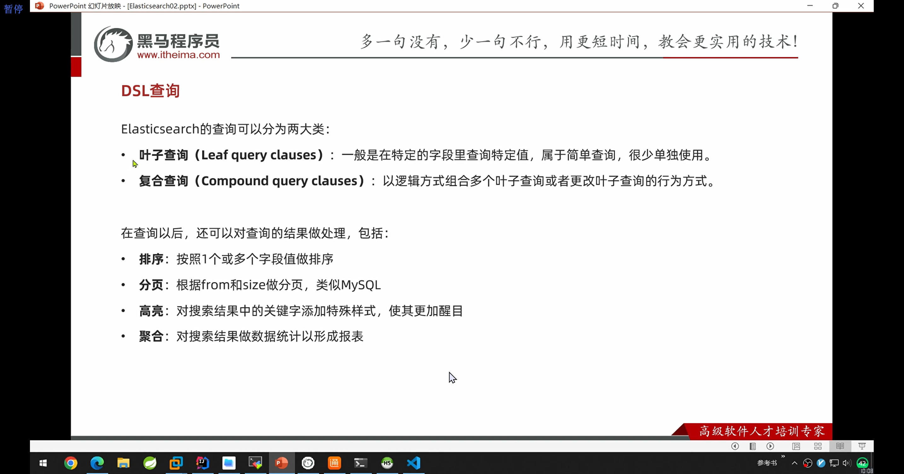

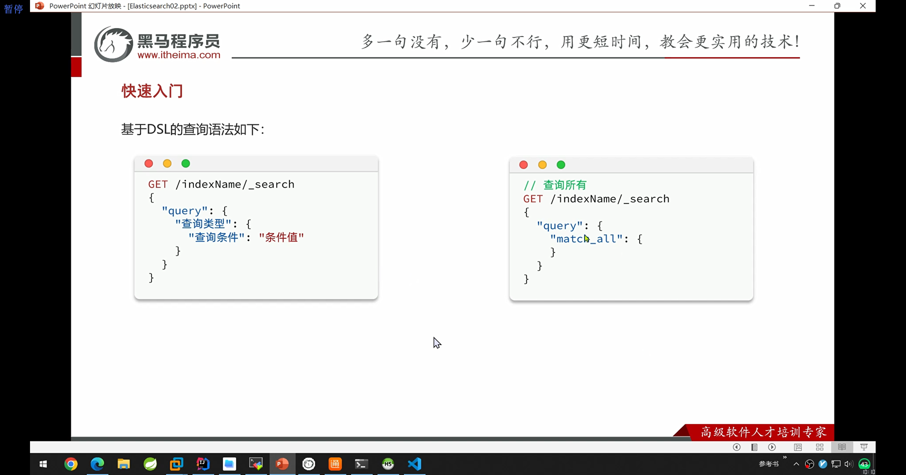

indexName是elasticsearch中库的name


对应的业务分析


叶子查询


```json
GET /items/_count

GET /items/_search
{
  "query": {
    "match_all": {
     
    }
  }
}

GET /items/_search
{
  "query": {
    "match": {
      "name":"脱脂牛奶"
    }
  }
}
```

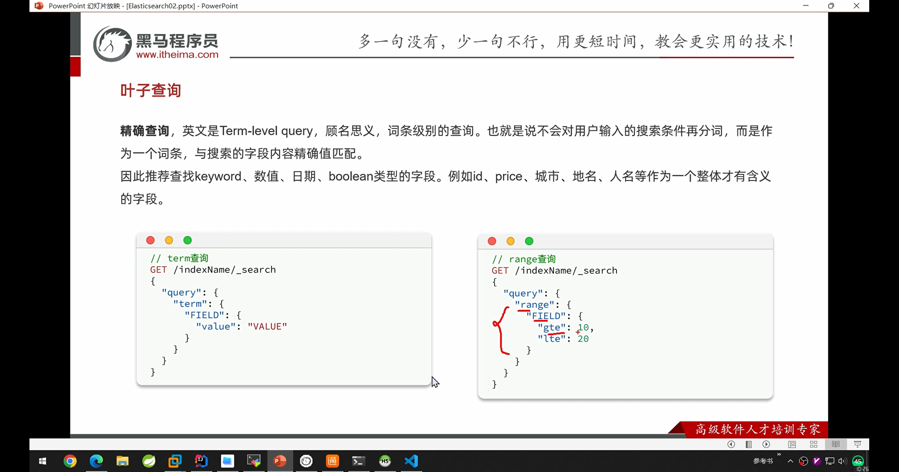

注意term的value是不会分词的，是精确匹配

```json

GET /items/_search
{
  "query": {
    "term": {
      "category": {
        "value": "牛奶"
      }
    }
  }
}

GET /items/_search
{
  "query": {
    "term": {
      "brand": {
        "value": "飞利浦"
      }
    }
  }
}

GET /items/_search
{
  "query": {
    "range": {
      "price": {
        "gte": 5000
      }
    }
  }
}
```

叶子查询总结

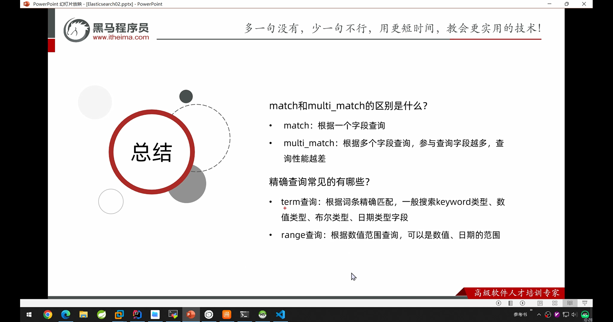

复合查询


布尔查询

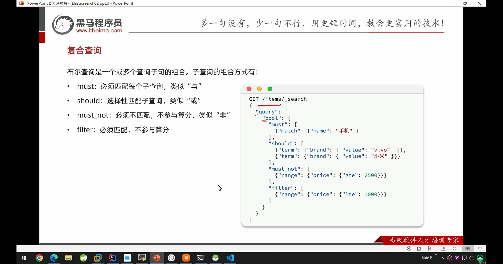

其中算分时关联度的意思。如果使用filter的搜索就不参与算法。不参与算分是不影响排名前后的，对于name来讲需要算分，但是对于range来讲不需要算分，因为算分会增加处理的时间。

复合查询

需求：搜索"智能手机"，但品牌必须是华为，价格必须是900~1599

```json
GET /items/_search
{
  "query": {
    "bool": {
      "must": [
        {
          "match": {
            "name": "智能手机"
          }
        }
      ],
      "filter": [
        {
          "term": {
            "brand": "华为"
          }
        },
        {
          "range": {
            "price": {
              "gte": 900,
              "lte": 1599
            }
          }
        }
      ]
    }
  }
}
```

一般情况下，我们认为过滤条件如分类、品牌、价格不应该参与算法。而关键字是必须要进行打分的

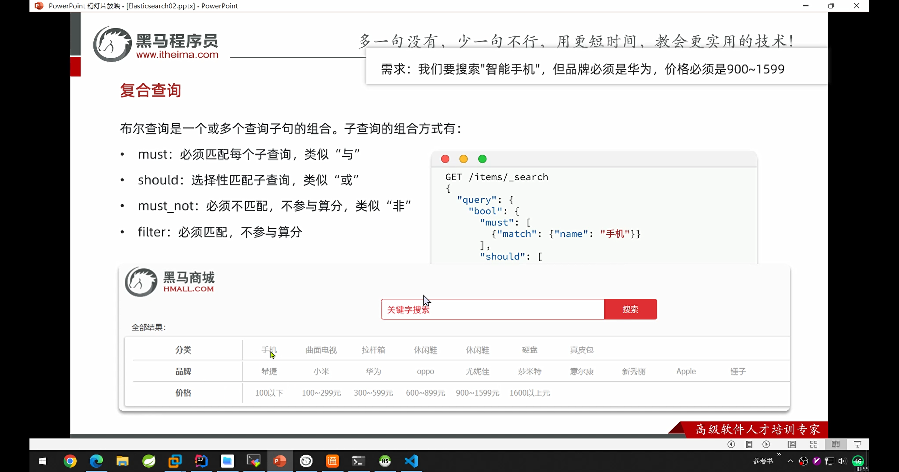

排序和分页

由于name可分词并且建立的是倒排索引，所以无法排序。而其它类型的字段如keyword字段都是可以做排序的

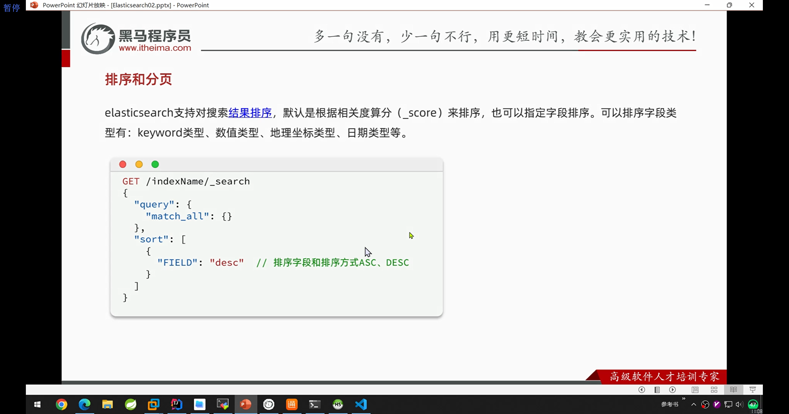

实现排序功能：

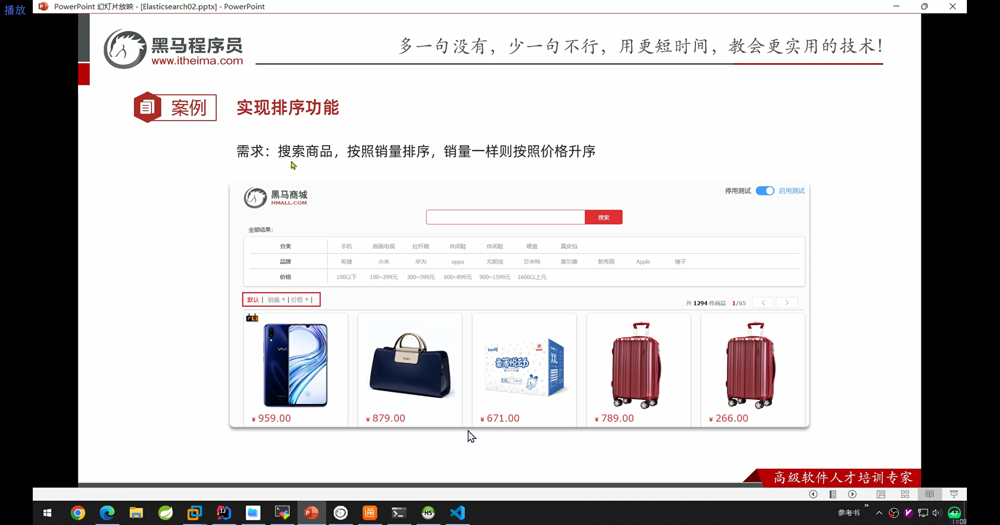

实现如下

```json
GET /items/_search
{
  "query": {
    "match_all": {
      
    }
  },
  "sort": [
    {
      "sold": {
        "order": "desc"
      },
      "price": {
        "order": "asc"
      }
    }
  ]
}

POST /items/_update/100000004580
{
  "doc": {
    "sold": 45454
  }
}

```

分页


```json
#from = (page - 1) * size
GET /items/_search
{
  "query": {
    "match_all": {
      
    }
  },
  "sort": [
    {
      "sold": {
        "order": "desc"
      },
      "price": {
        "order": "asc"
      }
    }
  ],
  "from": 2,
  "size": 2
}
```

分页实现案例


```json
GET /items/_search
{
  "query": {
    "match_all": {
      
    }
  },
  "sort": [
    {
      "sold": {
        "order": "desc"
      },
      "price": {
        "order": "asc"
      }
    }
  ],
  "size": 10
}
```

深度分页问题


深度分页思想：

select * from  where id > 99990 limit 0, 10


高亮显示


高亮显示

```json
GET items/_search
{
  "query": {
    "match": {
      "name": "脱脂牛奶"
    }
  },
  "highlight": {
    "fields": {
      "name":{
        
      }
    }
  }
}
```

javarestclient查询

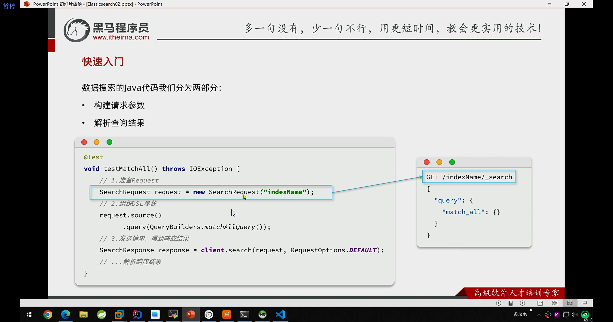

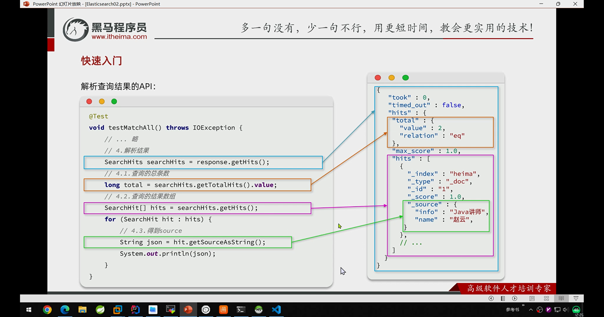

```java
@Test
void testSearchDemo() throws IOException {
    //1.准备request
    SearchRequest request = new SearchRequest("items");
    //2.准备DSL请求参数
    request.source()
            .query(QueryBuilders.matchAllQuery());
    //3.发送请求
    SearchResponse response = client.search(request, RequestOptions.DEFAULT);
    //4.结果解析
    SearchHits searchHits = response.getHits();
    //4.1 获取total数据
    long totalValue = searchHits.getTotalHits().value;
    System.out.println("total value: " + totalValue);
    //4.2 取数据
    SearchHit[] hits = searchHits.getHits();
    for (SearchHit hit : hits) {
        //4.4 获取source
        String json = hit.getSourceAsString();
        ItemDocDTO itemDoc = JSONUtil.toBean(json, ItemDocDTO.class);
        System.out.println("itemDoc: " + itemDoc);
    }
}
```

构建查询条件

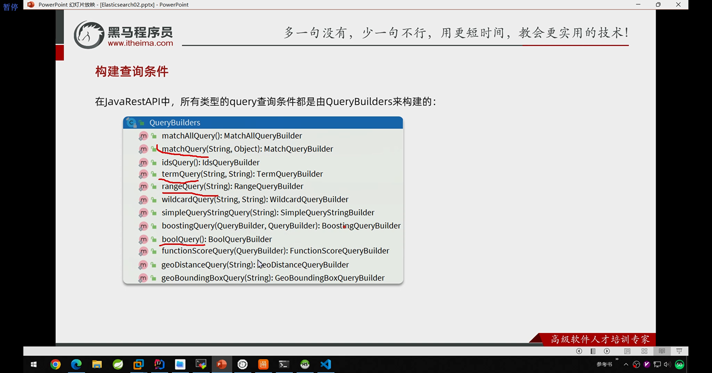

全文搜索的查询构造条件

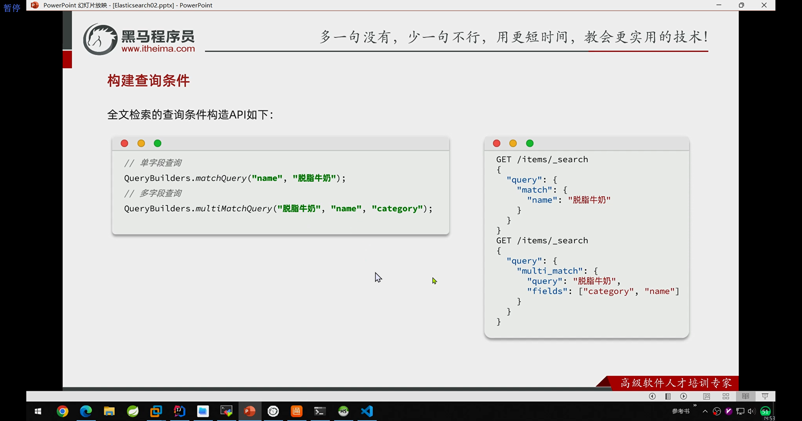

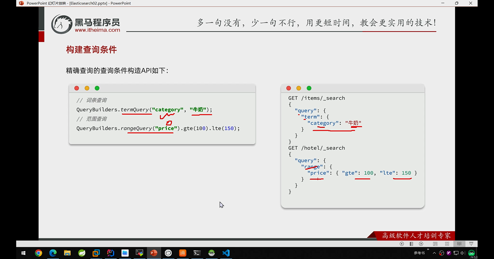

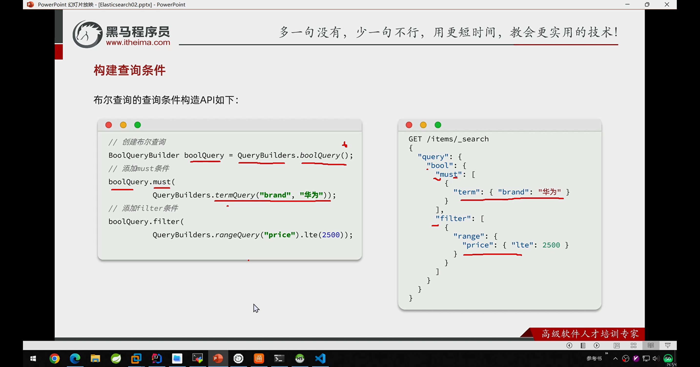

构建复杂查询的条件搜索

需求：利用javarestclient实现搜索功能，条件如下

1. 搜索关键词为脱脂牛奶

1. 品牌必须为德亚

1. 价格必须低于300

```json
GET items/_search
{
  "query": {
    "bool": {
      "must": [
        {
          "match": {
            "name": "脱脂牛奶"
          }
        }
      ],
      "filter": [
        {
          "term": {
            "brand": "德亚"
          }
        },
        {
          "range": {
            "price": {
              "lt": 300000
            }
          }
        }
      ]
    }
  },
  "sort": [
    { "sold": { "order": "desc" } },
    { "price": { "order": "asc" } }
  ],
  "size": 10
}
```

```java
@Test
void testComplexSearchDemo() throws IOException {
    //1.准备request
    SearchRequest request = new SearchRequest("items");
    //2.准备DSL请求参数
    BoolQueryBuilder queryBuilder = QueryBuilders.boolQuery();
    //2.1关键字搜索
    queryBuilder.must(QueryBuilders.matchQuery("name","脱脂牛奶"));
    //2.2过滤条件
    queryBuilder.filter(QueryBuilders.termQuery("brand","德亚"));
    queryBuilder.filter(QueryBuilders.rangeQuery("price").lt(30000));

    request.source().query(queryBuilder);

    //3.发送请求
    SearchResponse response = client.search(request, RequestOptions.DEFAULT);
    //4.结果解析
    SearchHits searchHits = response.getHits();
    //4.1 获取total数据
    long totalValue = searchHits.getTotalHits().value;
    System.out.println("total value: " + totalValue);
    //4.2 取数据
    SearchHit[] hits = searchHits.getHits();
    for (SearchHit hit : hits) {
        //4.4 获取source
        String json = hit.getSourceAsString();
        ItemDocDTO itemDoc = JSONUtil.toBean(json, ItemDocDTO.class);
        System.out.println("itemDoc: " + itemDoc);
    }
}
```

排序和分页的代码

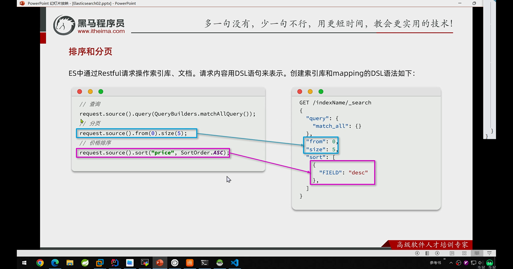

排序和分页的java实现

```java
@Test
void testSearchPageAndSortDemo() throws IOException {
   int pageNo = 1, pageSize = 10;
    //1.准备request
    SearchRequest request = new SearchRequest("items");
    //2.准备DSL请求参数
    //2.1搜索条件
    request.source().query(QueryBuilders.matchAllQuery());
    //2.2分页条件
    request.source().from((pageNo - 1)*pageSize).size(pageSize);
    //2.3排序条件
    request.source().sort("price", SortOrder.ASC);

    //3.发送请求
    SearchResponse response = client.search(request, RequestOptions.DEFAULT);
    //4.结果解析
    SearchHits searchHits = response.getHits();
    //4.1 获取total数据
    long totalValue = searchHits.getTotalHits().value;
    System.out.println("total value: " + totalValue);
    //4.2 取数据
    SearchHit[] hits = searchHits.getHits();
    for (SearchHit hit : hits) {
        //4.4 获取source
        String json = hit.getSourceAsString();
        ItemDocDTO itemDoc = JSONUtil.toBean(json, ItemDocDTO.class);
        System.out.println("itemDoc: " + itemDoc);
    }
}
```

高亮显示

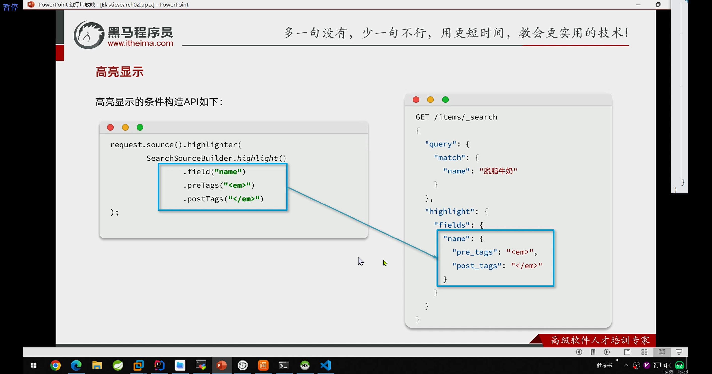

```java
@Test
void testSearchHeightDemo() throws IOException {
    //1.准备request
    SearchRequest request = new SearchRequest("items");
    //2.准备DSL请求参数
    //2.1搜索条件
    request.source().query(QueryBuilders.matchQuery("name", "脱脂牛奶"));
    //2.2高亮查询
    request.source().highlighter(
            SearchSourceBuilder.highlight().field("name")
    );
    //3.发送请求
    SearchResponse response = client.search(request, RequestOptions.DEFAULT);
    //4.结果解析
    System.out.println("response: " + response);
}
```

高亮结果的api解析（由于heighlight和source是平级的，所以需要进行解析）

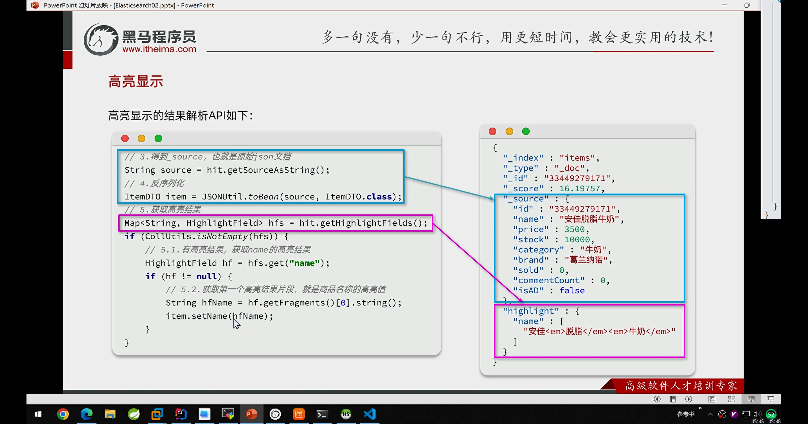

```java

@Test
void testSearchDeHeightDemo() throws IOException {
    //1.准备request
    SearchRequest request = new SearchRequest("items");
    //2.准备DSL请求参数
    //2.1搜索条件
    request.source().query(QueryBuilders.matchQuery("name", "脱脂牛奶"));
    //2.2高亮查询
    request.source().highlighter(
            SearchSourceBuilder.highlight().field("name")
    );
    //3.发送请求
    SearchResponse response = client.search(request, RequestOptions.DEFAULT);
    //4.结果解析
    SearchHits hits = response.getHits();
    for (SearchHit hit : hits) {
        //4.1得到原始的source
        String json = hit.getSourceAsString();
        //4.2反序列化
        ItemDocDTO itemDoc = JSONUtil.toBean(json, ItemDocDTO.class);
        //4.3获取高亮结果
        Map<String, HighlightField> hfs = hit.getHighlightFields();
        //4.4提取高亮结果
        if (!CollUtils.isEmpty(hfs)){
            //4.5 有高亮结果，获取name的高亮结果
            HighlightField hf = hfs.get("name");
            if (hf != null){
                //4.6 获取第一个高亮的结果
                String hfResult = hf.getFragments()[0].toString();
                //4.7 替换itemDoc中的name
                itemDoc.setName(hfResult);
                //4.8替换完之后输出
                System.out.println("itemDoc: " + itemDoc.getName());
            }
        }


    }
}
```

数据聚合

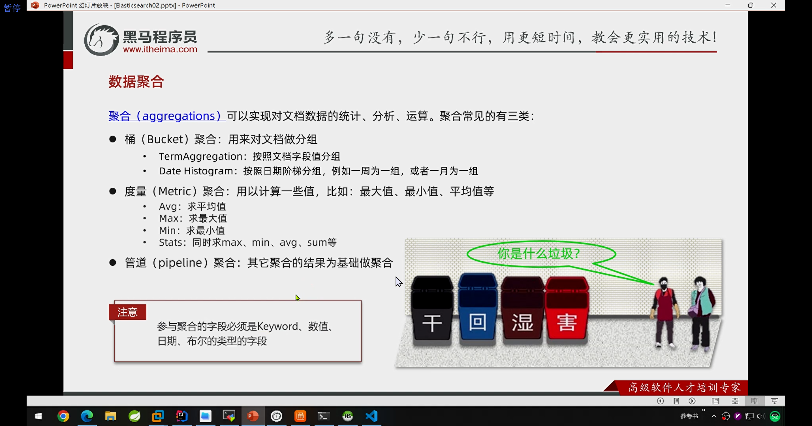

桶，就是类似于mysql中的group by， avg， count等分组

DSL聚合

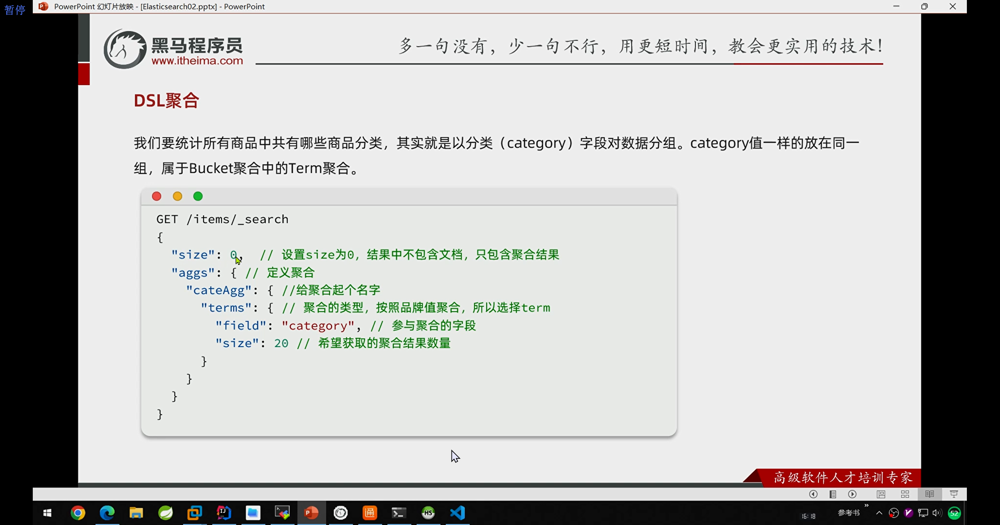

```json
#select category, count(*) from items group by category
GET /items/_search
{
  "size" : 10,
  "aggs": {
    "cateAgg": {
      "terms": {
        "field": "category",
        "size": 10
      }
    }
  }
}

```

带条件的聚合

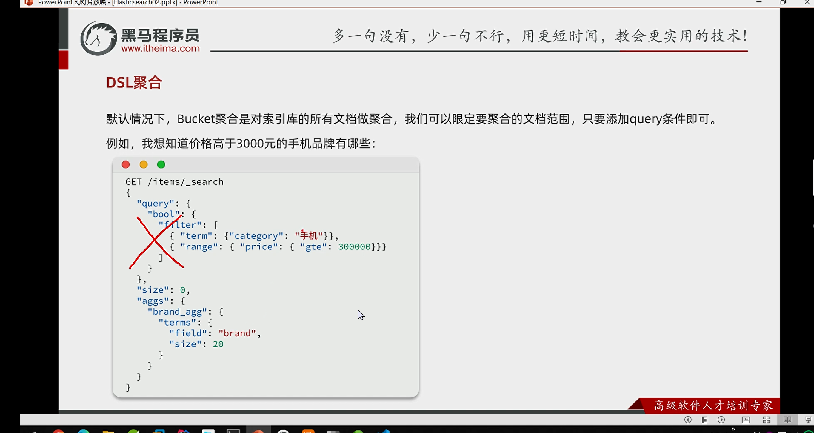

```json
#价格大于3000的手机品牌
GET /items/_search
{
  "size": 0, 
  "query": {
    "bool": {
      "filter": [
        {
          "term": {
            "category": "手机"
          }
        },
        {
          "range": {
            "price": {
              "gte": 3000
            }
          }
        }
      ]
    }
  }, 
  "aggs": {
    "cateAgg": {
      "terms": {
        "field": "brand",
        "size": 20
      }
    }
  }
}

```

对聚合内的数据进行统计和分析

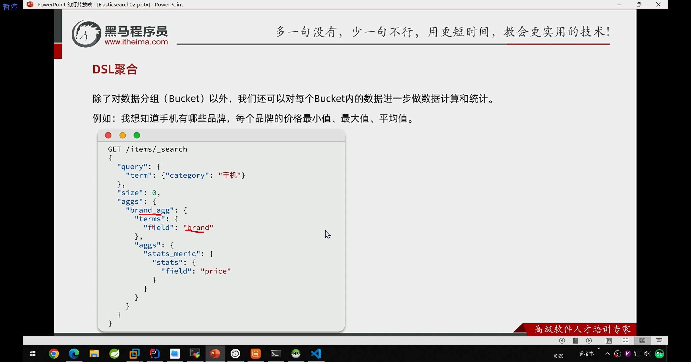

```json
GET /items/_search
{
  "size": 0,
  "query": {
    "bool": {
      "filter": [
        {
          "term": {
            "category": "手机"
          }
        }
      ]
    }
  },
  "aggs": {
    "brand_agg": {
      "terms": {
        "field": "brand"
      },
      "aggs":{
      "price_meric":{
        "stats": {
          "field": "price"
        }
      }
    }
  }
 }
}

```

restclient聚合

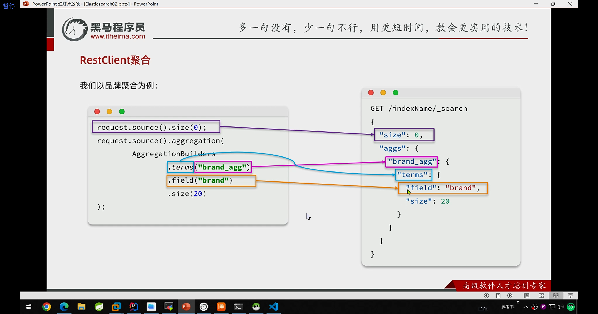

restclient处理聚合的结果


```java
@Test
void testAggs() throws IOException {
    //1.准备request
    SearchRequest request = new SearchRequest("items");
    //2.准备DSL请求参数
    //2.1搜索条件
    request.source().query(QueryBuilders.termQuery("category", "手机"));
    //2.2 设置搜索结果的数量
    request.source().size(0);
    //2.3 对品牌进行聚合(并进行嵌套）
    String aggsName = "brand_aggs";
    request.source().aggregation(
            AggregationBuilders
                    .terms(aggsName)
                    .field("brand")
                    .size(20)
                    .subAggregation(
                            AggregationBuilders
                                    .stats("price_statis")
                                    .field("price")
                    )
    );
    //3.发送请求
    SearchResponse response = client.search(request, RequestOptions.DEFAULT);
    //4.结果解析
    Aggregations aggregations = response.getAggregations();
    //4.1 根据名称获取聚合结果
    Terms brandTerms = aggregations.get(aggsName);
    List<? extends Terms.Bucket> buckets = brandTerms.getBuckets();
    //4.2 遍历
    for (Terms.Bucket bucket : buckets) {
        //获取key
        String brandName = bucket.getKeyAsString();
        long docCount = bucket.getDocCount();
        //获取嵌套的stats聚合结果
        Stats priceStats = bucket.getAggregations().get("price_statis");
        double avgPrice = priceStats.getAvg();
        double maxPrice = priceStats.getMax();
        double minPrice = priceStats.getMin();
        long count = priceStats.getCount();
        double sum = priceStats.getSum();

        System.out.printf("品牌: %s, 商品数: %d, 平均价: %.2f, 最高价: %.2f, 最低价: %.2f%n",
                brandName, docCount, avgPrice, maxPrice, minPrice);
    }
}
```